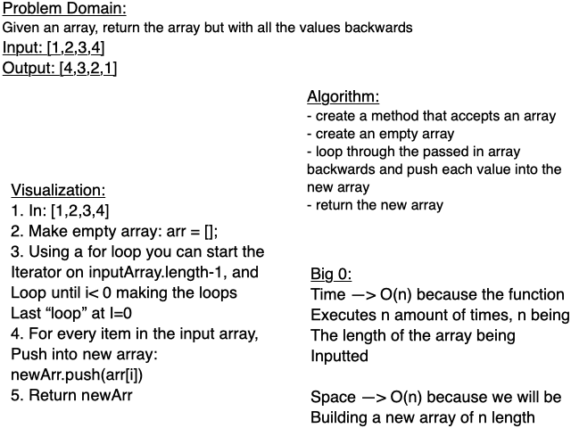

# Code Challenge: Class 01

**Whiteboard Only Challenge Today**
Code would look something like:

reverseArray = ( arr ) => {
  let newArr = [];
  if(arr.length>1){
    for(let i = arr.length-1; i<0; i--){
      newArr.push(arr[i]);
    }
    return newArr;
  }
  return arr;
}
