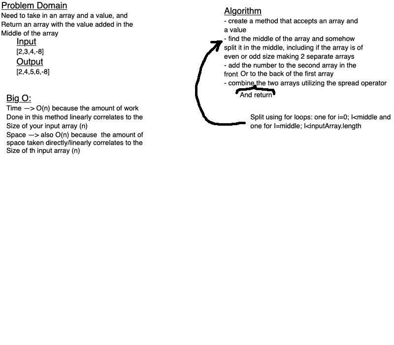

# Code Challenge: Class 01

**Whiteboard Only Challenge Today**
Code would look something like:

let insertShiftArray = (arr, val) => {
    let middle = 0;
    if(arr.length%2===0){
        middle = arr.length/2;
    }
    else{
        middle = Math.ceil(arr.length/2);
    }
    let arr1 = [];
    let arr2 = [];

    for(let i=0; i<middle; i++){
        arr1[i] = arr[i];
    }

    arr2[0] = val;
    let j = 1;
    for(let i=middle; i<arr.length; i++){
        arr2[j] = arr[i];
        j++;
    }
    return [...arr1, ...arr2];
}
