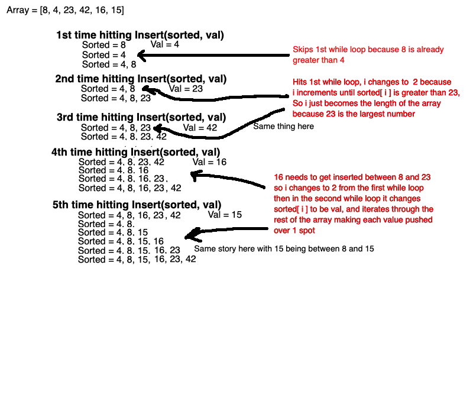

# Challenge 17: Tree Fizz Buzz

## O(n)

Time: O(n^2) at worst if the array is already sorted from largest to smallest
Space: O(n) because we're always making a new array n long

[Blog](https://docs.google.com/document/d/1GrZx0PQ72ZW6JbI_ABQnXRYNHcWwE19-sYepRYPi77A/edit?usp=sharing)
