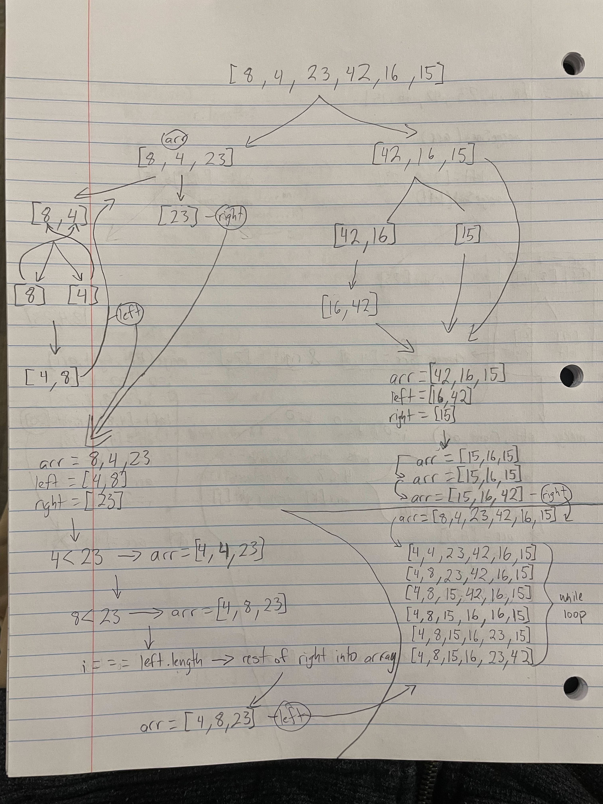

# Challenge 27: mergeSort

## O(n)

**Time**: O(n*log(n)) because depending on the size of the input array we are dividing it down into 2 over and over again, so slower than O(n) by a bit because we're not just checking each value once, but checking it more than once guaranteed (depending on how large the input array is), but not so much that its O(n^2)
**Space**: O(n) because we're always making 2 new arrays for each half until we get to either 1 or two numbers, so we're making a new array for each value in the input array: [1,2,3,4] => [1], [2], [3], [4]

### Blog

Mergesort is a recursive sorting algorith that keeps splitting the input array into halves until you get to the case where you can't split it any more, then checking those values of left and right and rearranging the numbers so that they are sorted. Here is an example:

arr = [8, 4, 23, 42, 16, 15];
looking at the picture above you can see that we split the array into a left and a right:
left = [8,4,23] and right = [42,16,15]

then we take the left again and split it becuase mergeSort(left) was called:
left = [8] and right = [4, 23]

left is left along because it's only got 1 value, but right gets split again: mergeSort(right)
left = [4] and right = [23]

now the helper function merge is called with merge(left([4]) right([23]) and arr([4, 23]))
merge takes these numbers and checks if left or right is smaller, if left then it goes in, if right then it goes in. merge changes the input arr from [4, 23] to [4, 23] (and yes it actually changed the values to the same values lol)

now that right is sorted from the step above merge gets called again  with [8] as the left and [4, 23] as the right: merge(left, right, arr) =>(arr is [8, 4, 23])
merge checks to see if left[i] - (8) is less than right[j] - (4), it is not so 4 gets appended to arr[k] =>   arr = [4, 4, 23]
then it appends 8 =>   arr = [4, 8, 23]
then it appends 23 =>   arr = [4, 8, 23] (and yes it does append in this example)

so now the whole left side of the array is sorted from [8, 4, 23] to [4, 8, 23]
same thing happens on the right side => [42, 16, 15] becomes [15, 16, 42]
then the final merge checks each value of both left and right and appends them to the original array in the order from least to greatest
