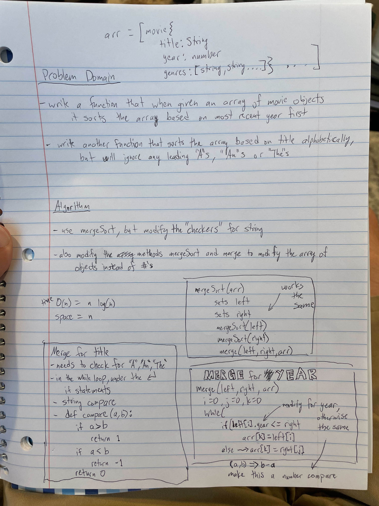

# Challenge 28: Merge Sort for Objects

## O(n)

**Time**: O(n*log(n)) because depending on the size of the input array we are dividing it down into 2 over and over again, so slower than O(n) by a bit because we're not just checking each value once, but checking it more than once guaranteed (depending on how large the input array is), but not so much that its O(n^2)
**Space**: O(n) because we're always making 2 new arrays for each half until we get to either 1 or two numbers, so we're making a new array for each value in the input array: [1,2,3,4] => [1], [2], [3], [4]
